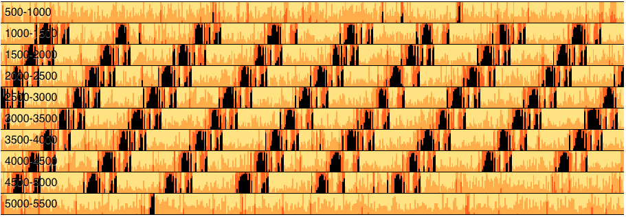

# Confidence
Visualization of model confidence on genomic sequences



# installation
```bash
git clone https://github.com/hiddengenome/Confidence.git
cd Confidence
virtualenv env
source env/bin/activate
pip install argparse numpy h5py flask
```

# Usage

Run the Server with python 2 and point your browser to http://127.0.0.1:5000/

### Visualize a single sequence
```bash
python visualize.py -i examples/crispr.h5
```

To visualize a specific region of a long sequence, you can use `-from` and `-to` parameters

```bash
python visualize.py -i example/full.h5 -from 1000 -to 2500
```
### Visualize multiple sequences 
```bash
python visualize_individual.py -i examples/h5Test.h5
```
Then you will see a list of sequences in the webpage, and you can choose the sequences and define the region you'd like to visualize. The example contains the states of 20 rRNA sequences.
